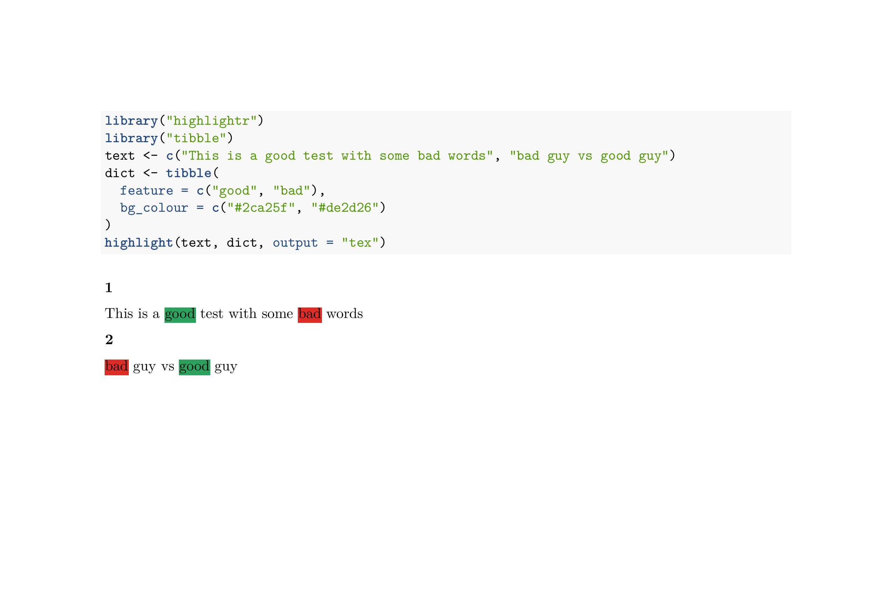

<!-- README.md is generated from README.Rmd. Please edit that file -->

# highlightr: highlight text in R output

<!-- badges: start -->

[](https://travis-ci.org/JBGruber/highlightr)
[](https://codecov.io/gh/JBGruber/highlightr?branch=master)
[](https://www.tidyverse.org/lifecycle/#experimental)
<!-- badges: end -->


When you hate paper and pens but still want to highlight stuff.

**If you want this project to become better, please don’t hesitate to
file an [issue report](https://github.com/JBGruber/rwhatsapp/issues) or
create pull requests. Thanks.**

## Installation

You can install highlightr from GitHub with:

``` r
# install.packages("devtools")
devtools::install_github("JBGruber/highlightr")
```

## Usage

You can use `highlightr` with different output formats:

### HTML/Interactive

If you run your code interactively (for example in `RStudio`), the
`highlight` function displays a html document in the Viewer pane (in
`RStudio`) or separate window:

``` r
library("highlightr")
library("tibble")
text <- c("This is a good test with some bad words", "bad guy vs good guy")
dict <- tibble(
  feature = c("good", "bad"),
  bg_colour = c("#2ca25f", "#de2d26")
)
highlight(text, dict)
```


If you place this code chunk in an `RMarkdown` document with `output:
html_document`, the highlighted text will appear in the knitted **HTML**
output.

### LaTeX/PDF

If you want to output a PDF, you need to include two LaTeX packages in
your header: `xcolor` and `soul`. You can do so in an `RMarkdown`
document with the argument `header-includes` like this:

``` markdown
---
output: pdf_document
header-includes:
   - \usepackage{xcolor}
   - \usepackage{soul}
---
``{r results='asis'}
library("highlightr")
library("tibble")
text <- c("This is a good test with some bad words", "bad guy vs good guy")
dict <- tibble(
  feature = c("good", "bad"),
  bg_colour = c("#2ca25f", "#de2d26")
)
highlight(text, dict, output = "tex")
```

<kbd>  </kbd>
